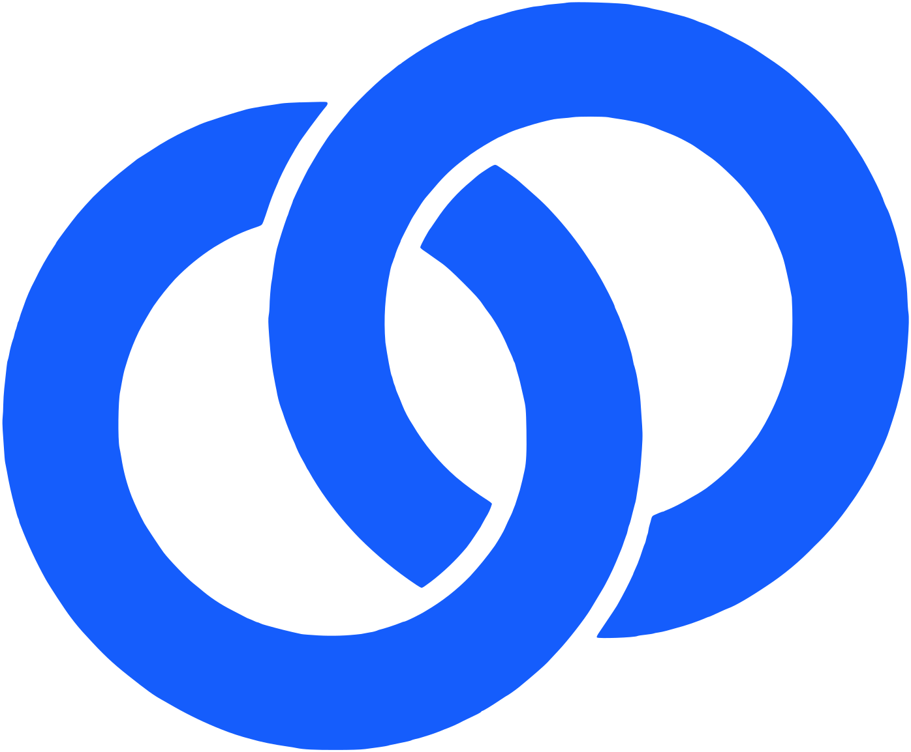
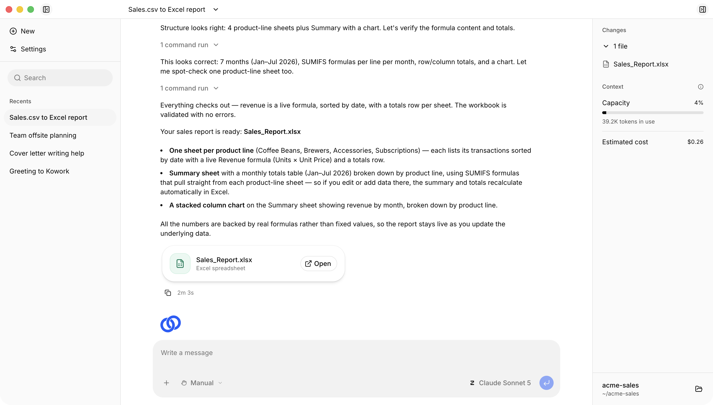

<p align="center">
  
</p>
<h1 align="center">Kowork</h1>
<p align="center">An open-source <a href="https://claude.com/product/cowork">Claude Cowork</a> alternative that gets things done on your desktop.</p>
<p align="center">
  <a href="https://github.com/MrHertal/kowork/actions/workflows/check.yml"></a>
  <a href="https://github.com/MrHertal/kowork/releases/latest"></a>
  <a href="LICENSE"></a>
</p>
<p align="center">
  <a href="https://getkowork.com"><strong>Website</strong></a> ·
  <a href="https://getkowork.com/docs/"><strong>Documentation</strong></a>
</p>



Kowork is where you hand real work to AI agents. Describe the outcome in plain language — an agent works in a folder you choose, plans the steps, and does the job. You come back to finished work, ready for review.

Kowork is built on top of [OpenCode](https://github.com/anomalyco/opencode).

## Download

Get the latest build from the [releases page](https://github.com/MrHertal/kowork/releases/latest):

| Platform              | Download                        |
| --------------------- | ------------------------------- |
| macOS (Apple Silicon) | `kowork-electron-mac-arm64.dmg` |
| Windows (x64)         | `kowork-electron-win-x64.exe`   |

> [!NOTE]
> **Windows users:** the Kowork installer is not code-signed yet, so Windows will likely show a blue "Windows protected your PC" (Microsoft Defender SmartScreen) warning when you run it. This is expected for new, unsigned apps — it is a reputation warning, not a virus detection. Click **More info**, then **Run anyway** to install. Only download Kowork from the official releases page linked above.

## Features

- **Works where your files are** — agents read, create, and organize files directly in a folder on your computer. No uploading documents into a chat; the work happens in place.
- **Real Office documents** — built-in skills create and edit genuine Word documents, Excel spreadsheets (formulas and charts included), PowerPoint decks, and PDFs. Polished files, not plain text.
- **Your choice of AI provider** — sign in or paste an API key for Anthropic, OpenAI, Google, GitHub Copilot, OpenRouter, and more. Switch models anytime; no lock-in.
- **Parallel work** — run several tasks at once, split big jobs into subtasks.
- **Connectors** — plug agents into external tools and data (MCP servers).
- **Eight languages** — English, French, German, Spanish (Latin America and Spain), Simplified Chinese, Hindi, Brazilian Portuguese.

## Development

Requires Node 24 (see `.nvmrc`), pnpm (via `corepack enable`), and Bun (for the sidecar).

```bash
git clone --recurse-submodules https://github.com/MrHertal/kowork.git
cd kowork
corepack enable && pnpm install
bun install --cwd opencode
pnpm dev
```

`pnpm dev` builds the OpenCode sidecar and launches the desktop app. The first run also builds the document-skill runtime, so it can take a few minutes.

Each package under `packages/` has its own README with commands and structure notes.

**[Contributing](CONTRIBUTING.md)** · **[Security](SECURITY.md)** · **[MIT License](LICENSE)**

<sub>Claude and Claude Cowork are trademarks of Anthropic, PBC. Kowork is not affiliated with, sponsored, or endorsed by Anthropic.</sub>

<sub>Kowork is not built by the OpenCode team and is not affiliated with OpenCode in any way.</sub>
